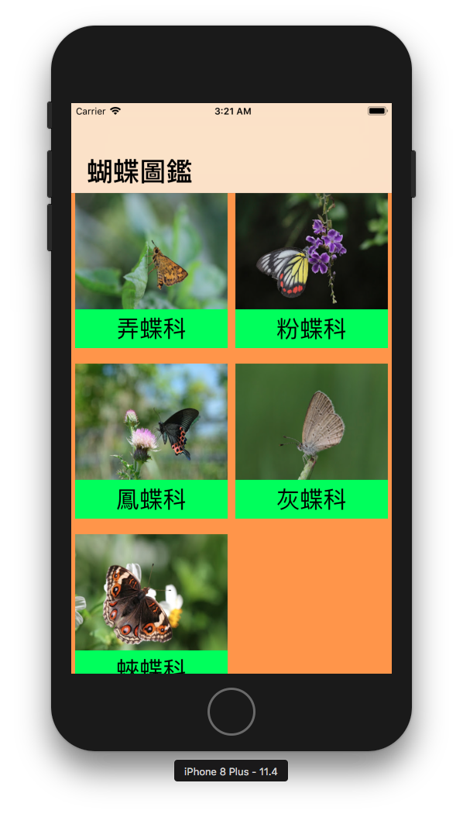
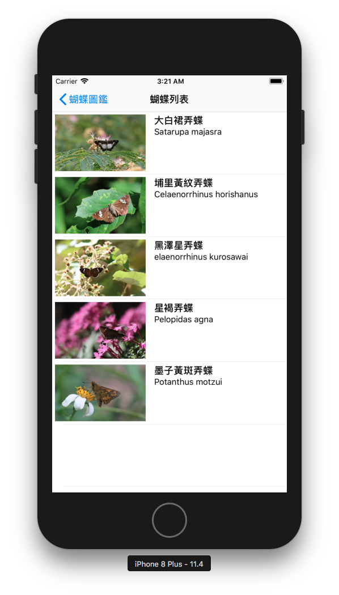
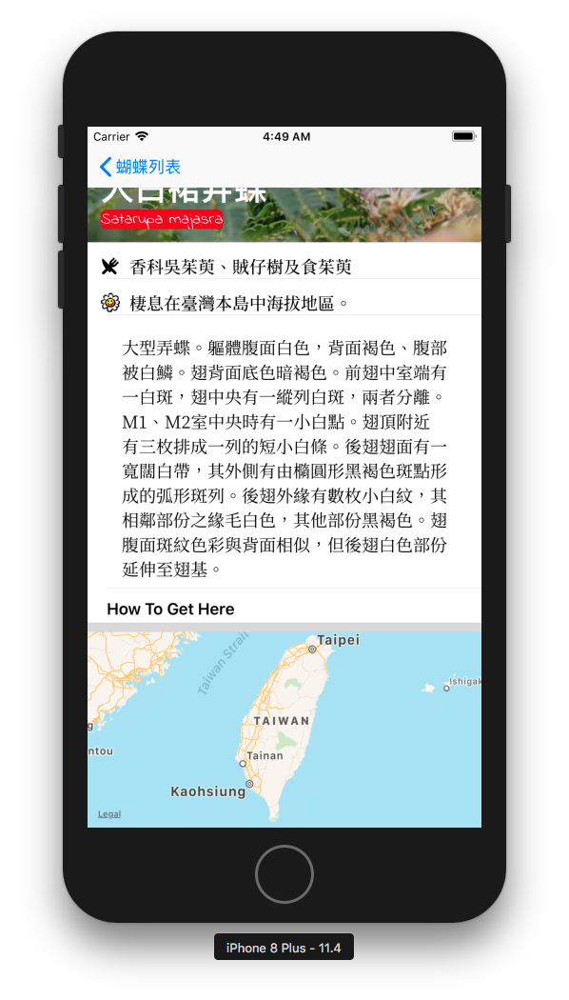
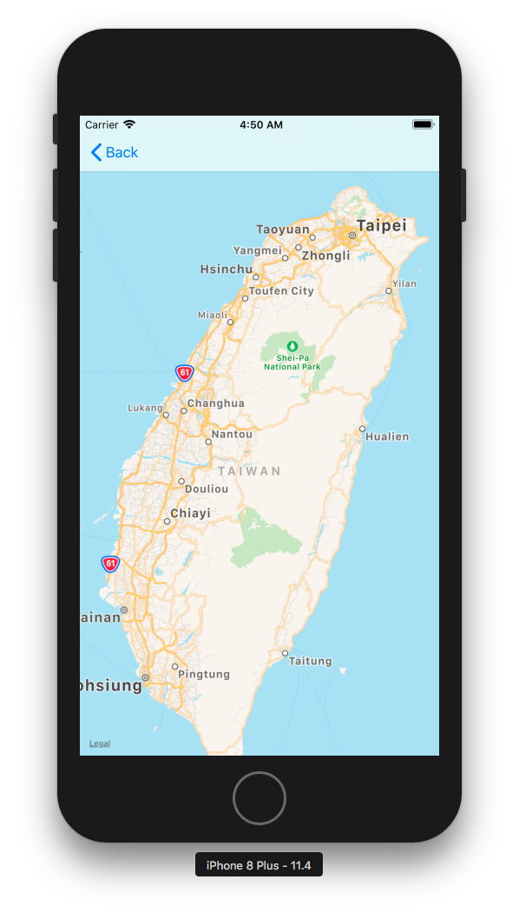
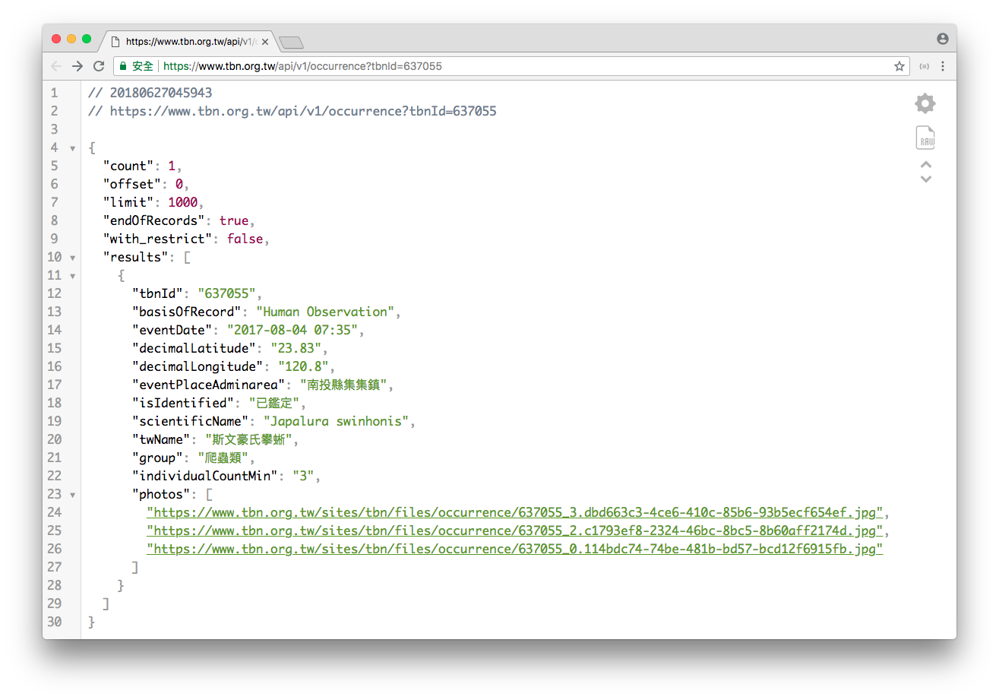

 
# 蝴蝶圖鑑＿期末專案
APP說明：本程式內容為蝴蝶簡易圖鑑，圖片來源來自暨南國際大學劉震昌教授經營「台灣蝴蝶誌 (Butterflies in Taiwan)」授課內容授權使用圖片、圖鑑文字內容來源為「台灣生物多樣性網路 (Taiwan Biodiversity Network)」內容文件授權皆為開放自由索取，所以由上述網頁中抓取學名、分佈位置、生態型性等...。

### ！注意！作者聲明

###### (1) 資料來源近期因網站維護可能會收不到分布的位置。

###### (2) 圖片如有需要請寄「信箱」(jcliu@ncnu.edu.tw)索取授權

###### (2) 圖鑑的內容參考來自TBN生物多樣性(https://www.tbn.org.tw/)

### 開始畫面的 Storyboard 設計
# 

### 點入科目分類頁面，出現該蝴蝶科目列表

# 

### 點入列表其中項目後，載入該筆資料內容

# 
# 

### 點擊小地圖後會進入大地圖頁面同時將座標放入(!注意！ 此部分是直接抓取網頁資料要等待載入)

# 

## 資料來源：API介面
API我們使用名稱來收尋我們要的該筆資料的分佈位置
# 

